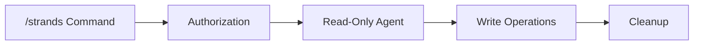

# Strands Command GitHub Actions

AI-powered automation for GitHub issues and pull requests using Strands Agents SDK.

## Overview

This system enables AI-powered assistance through `/strands` commands:

- **Issue Refinement**: `/strands` on issues to clarify requirements
- **Issue Implementation**: `/strands implement` to create PRs from issues
- **PR Review**: `/strands` on PRs for AI-assisted code review

## Architecture



## Quick Start

1. Comment `/strands [task]` on any issue or PR
2. The agent will process your request
3. Results are posted as comments or code changes

## Commands

| Command | Context | Description |
|---------|---------|-------------|
| `/strands` | Issue | Refine and clarify the issue |
| `/strands implement` | Issue | Create a PR implementing the issue |
| `/strands` | PR | Review the PR and provide feedback |
| `/strands [custom task]` | Any | Execute a custom task |

## Components

### strands-agent-runner

Executes AI agents with AWS Bedrock integration.

**Inputs:**
- `ref`: Git reference to checkout
- `system_prompt`: System instructions for the agent
- `task_prompt`: Task description
- `aws_role_arn`: AWS IAM role ARN
- `write_permission`: Enable/disable write operations

### strands-write-executor

Executes write operations from agent artifacts.

**Inputs:**
- `ref`: Target branch for changes
- `issue_id`: Associated issue number

## Agent SOPs

- `task-implementer.sop.md`: TDD-based feature implementation
- `task-reviewer.sop.md`: Code review guidelines
- `task-refiner.sop.md`: Issue clarification process

## AWS Configuration

Requires IAM role with Bedrock permissions:

```json
{
  "Effect": "Allow",
  "Action": [
    "bedrock:InvokeModelWithResponseStream",
    "bedrock:InvokeModel"
  ],
  "Resource": "*"
}
```

## Model

Uses Claude Opus 4.5 via Amazon Bedrock (ap-northeast-1).
