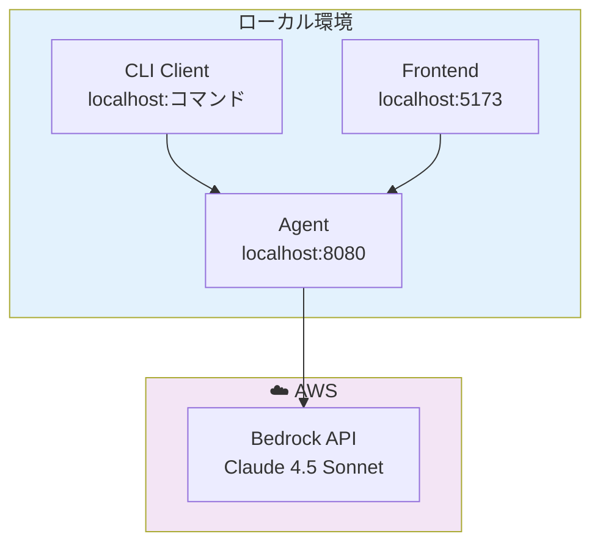

# Fullstack AgentCore

AWS Bedrock AgentCore を使用したフルスタック AI エージェントシステム。ローカル開発とAWSデプロイの両方をサポートします。

## 🏗️ アーキテクチャ概要

### ローカル開発構成



### システム構成

- **Frontend**: React + Vite + Tailwind CSS
- **Agent**: Express + Strands Agents SDK
- **AI Model**: AWS Bedrock Claude 4.5 Sonnet
- **CLI**: Commander.js ベースのクライアント

## 📁 プロジェクト構造

```
fullstack-agentcore/
├── packages/
│   ├── cdk/                    # AWS インフラストラクチャ (CDK)
│   │   ├── lib/                # スタックと Construct 定義
│   │   └── bin/                # CDK アプリケーション
│   │
│   ├── agent/                  # Agent Runtime (Express + Strands)
│   │   ├── src/                # Agent 実装
│   │   ├── scripts/            # 開発スクリプト
│   │   └── docker-compose.yml  # Docker 設定
│   │
│   ├── frontend/               # React Frontend (Vite)
│   │   ├── src/                # Frontend コード
│   │   └── public/             # 静的ファイル
│   │
│   ├── client/                 # CLI クライアント
│   │   └── src/                # CLI 実装
│   │
│   └── lambda-tools/           # AgentCore Gateway ツール
│       └── tools/echo-tool/    # サンプル Lambda ツール
│
├── package.json                # Workspace 設定
├── openapi.yaml               # API ドキュメント
└── README.md                  # このファイル
```

## 🚀 Getting Started (ローカル開発)

### 前提条件

- **Node.js 18+**
- **Docker** (推奨)
- **AWS CLI** 設定済み (Bedrock API 利用のため)

### Step 1: 依存関係のインストール

```bash
# ルートディレクトリで実行
npm install
```

### Step 2: Agent の環境設定・起動

#### 環境変数の設定

```bash
# Agent 環境変数設定
cp packages/agent/.env.example packages/agent/.env
```

`packages/agent/.env` を編集：

```bash
# AWS 認証情報
AWS_ACCESS_KEY_ID=your_access_key_id
AWS_SECRET_ACCESS_KEY=your_secret_access_key
AWS_REGION=us-west-2

# Bedrock 設定
BEDROCK_MODEL_ID=global.anthropic.claude-sonnet-4-5-20250929-v1:0
BEDROCK_REGION=us-west-2

# 開発設定
LOG_LEVEL=info
DEBUG_MCP=false
```

#### Agent の起動（2つの方法）

**方法A: Docker で起動 (推奨)**

```bash
npm run agent:docker
```

**方法B: 直接起動**

```bash
npm run agent:dev
```

### Step 3: 動作確認

#### 方法A: CLI で確認

```bash
# CLI 環境設定
cp packages/client/.env.example packages/client/.env

# CLI で Agent に質問
npm run client:dev -- invoke "今日の天気を教えて"
```

#### 方法B: Frontend で確認

```bash
# Frontend 環境設定
cp packages/frontend/.env.example packages/frontend/.env
```

`packages/frontend/.env` を編集：

```bash
# Agent API 設定
VITE_AGENT_ENDPOINT=http://localhost:8080/invocations

# Cognito 設定（必要に応じて）
VITE_COGNITO_USER_POOL_ID=us-east-1_xxxxxxxxx
VITE_COGNITO_CLIENT_ID=xxxxxxxxxxxxxxxxxxxxxxxxxx
VITE_AWS_REGION=us-east-1
```

Frontend 起動：

```bash
npm run frontend:dev
```

ブラウザで http://localhost:5173 にアクセス

## ☁️ AWS デプロイ

### CDK デプロイ

```bash
# CDK の初回デプロイ
npm run deploy
```

### デプロイ後の設定

デプロイ完了後、出力された情報を使って環境変数を更新：

```bash
# CLI で AWS に接続
# packages/client/.env
AGENTCORE_RUNTIME_ARN=arn:aws:bedrock-agentcore:us-east-1:ACCOUNT_ID:runtime/YOUR_RUNTIME_ID

# Frontend で AWS に接続
# packages/frontend/.env  
VITE_AGENT_ENDPOINT=https://your-gateway-id.bedrock-agentcore.us-east-1.amazonaws.com/invocations
```

## 🛠️ 開発コマンド

### Agent 関連

```bash
npm run agent:dev              # Agent 開発サーバー起動
npm run agent:docker           # Docker で起動
npm run agent:docker:detach    # Docker バックグラウンド起動
npm run agent:docker:stop      # Docker 停止
```

### Frontend 関連

```bash
npm run frontend:dev           # 開発サーバー起動
npm run frontend:build         # ビルド
npm run frontend:preview       # プレビュー
```

### CLI 関連

```bash
npm run client:dev             # CLI 開発モード
npm run client:dev -- invoke "質問"  # 直接実行
```

### CDK 関連

```bash
npm run deploy                 # デプロイ
npm run synth                  # テンプレート生成
npm run diff                   # 差分確認
```

## 🔧 技術仕様

### 使用技術

| 分野 | 技術 |
|------|------|
| **Runtime** | AWS Bedrock AgentCore Runtime |
| **AI Model** | Claude 4.5 Sonnet (グローバル推論プロファイル) |
| **Agent Framework** | Strands Agents SDK |
| **Frontend** | React 19 + Vite + Tailwind CSS |
| **Authentication** | Amazon Cognito User Pool (JWT) |
| **API Gateway** | AgentCore Gateway |
| **Infrastructure** | AWS CDK (TypeScript) |
| **CLI** | Commander.js + Chalk |

### 環境設定

```typescript
// Agent 設定
BEDROCK_MODEL_ID: "global.anthropic.claude-sonnet-4-5-20250929-v1:0"
PORT: 8080

// Frontend 設定
VITE_AGENT_ENDPOINT: "http://localhost:8080/invocations"

// CLI 設定
AGENTCORE_ENDPOINT: "http://localhost:8080"
```

## 🧪 テスト・デバッグ

### Agent のログ確認

```bash
# Docker ログ確認
npm run agent:docker:logs

# 開発モードではコンソールに直接出力
npm run agent:dev
```

### デバッグモードの有効化

```bash
# packages/agent/.env
DEBUG_MCP=true
LOG_LEVEL=debug
```

## 📚 詳細ドキュメント

より詳細な技術情報については、[docs](./docs/) フォルダをご覧ください：

- **[AWS クラウドアーキテクチャ](./docs/aws-architecture.md)** - AWS デプロイ構成図、リソース詳細、監視・運用
- **[JWT 認証システム](./docs/jwt-authentication.md)** - JWT 認証フロー、実装詳細、セキュリティ
- **[ドキュメント一覧](./docs/README.md)** - 全ドキュメントのインデックス

## 📖 参考資料

- [AWS Bedrock AgentCore Documentation](https://docs.aws.amazon.com/bedrock/latest/userguide/agents-runtime.html)
- [Strands Agents SDK](https://docs.strands-ai.com/)
- [Amazon Cognito JWT Tokens](https://docs.aws.amazon.com/cognito/latest/developerguide/amazon-cognito-user-pools-using-tokens-with-identity-providers.html)

## 🤝 コントリビューション

1. Fork the repository
2. Create your feature branch (`git checkout -b feature/amazing-feature`)
3. Commit your changes (`git commit -m 'Add some amazing feature'`)
4. Push to the branch (`git push origin feature/amazing-feature`)
5. Open a Pull Request

## 📄 ライセンス

MIT License - 詳細は [LICENSE](LICENSE) ファイルをご覧ください。

---

## ✨ ローカル開発のポイント

- **Agent**: `npm run agent:docker` で簡単起動
- **Frontend**: `npm run frontend:dev` でホットリロード開発
- **CLI**: `npm run client:dev -- invoke "質問"` で即座にテスト
- **統合**: 3つのコンポーネントが localhost で連携

デプロイ不要で、ローカル環境ですべての機能を体験できます！
