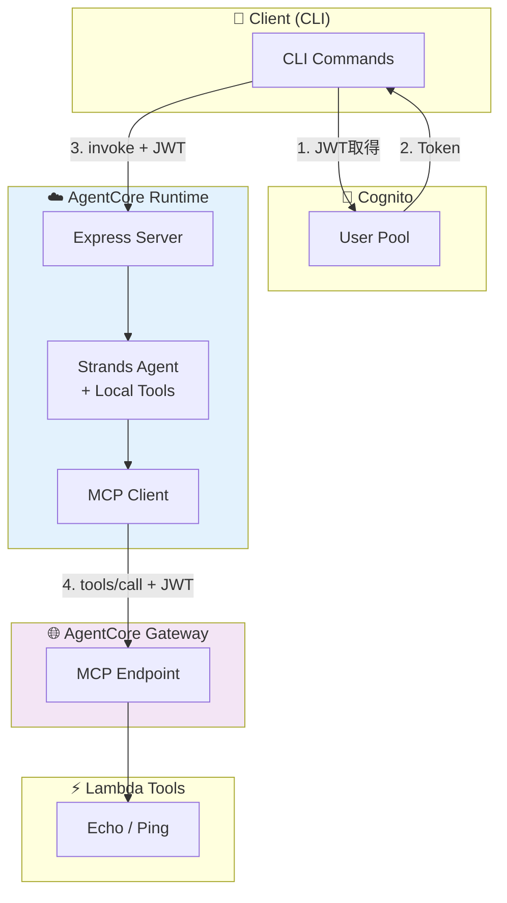

# AWS クラウドアーキテクチャ

## 🏗️ AWS デプロイ構成図



## 🔗 AWS リソース

### AgentCore Runtime

- **Service**: AWS Bedrock AgentCore Runtime
- **Configuration**: 
  - Model: Claude 4.5 Sonnet (グローバル推論プロファイル)
  - Request Header: `Authorization` allowlisted
  - Environment Variables:
    ```typescript
    BEDROCK_MODEL_ID: "global.anthropic.claude-sonnet-4-5-20250929-v1:0"
    AGENTCORE_GATEWAY_ENDPOINT: "https://api.gateway.endpoint"
    ```

### AgentCore Gateway

- **Service**: API Gateway with Lambda integration
- **Features**:
  - JWT authentication validation
  - MCP tools/call endpoint
  - Lambda function proxy

### Cognito User Pool

- **Configuration**:
  - User Pool ID: `us-east-1_XXXX`
  - Client ID: `XXXXXXXXXXXXXX`
  - Token Type: Access Token (Bearer)
  - Token Expiration: 1 hour

### Lambda Tools

- **Echo Tool**: Simple echo and ping functionality
- **JWT Validation**: Automatic token validation at gateway level

## 📊 監視・運用

### CloudWatch メトリクス

- AgentCore Runtime 呼び出し数
- JWT 認証成功/失敗数
- ツール実行時間
- エラー率

### アラート設定

- JWT 認証失敗率 > 5%
- Runtime エラー率 > 1%
- レスポンス時間 > 30 秒

### ログ確認

CloudWatch でリアルタイムログを確認：

```bash
# Runtime ログ確認
aws logs describe-log-groups --log-group-name-prefix "/aws/bedrock-agentcore/runtimes"

# 最新ログストリーム確認
aws logs describe-log-streams \
  --log-group-name "/aws/bedrock-agentcore/runtimes/StrandsAgentsTS-XXXXX-DEFAULT" \
  --order-by LastEventTime --descending --max-items 1

# ログ内容確認
aws logs get-log-events \
  --log-group-name "/aws/bedrock-agentcore/runtimes/StrandsAgentsTS-XXXXX-DEFAULT" \
  --log-stream-name "STREAM_NAME"
```

## 🔒 セキュリティ

### 実装されたセキュリティ機能

1. **JWT 署名検証**: Cognito による自動検証
2. **トークン有効期限**: 1 時間の短期間トークン
3. **スコープ分離**: ツール一覧は認証不要、実行は認証必須
4. **リクエストスコープ**: AsyncLocalStorage による安全な認証情報管理

### セキュリティベストプラクティス

- JWT トークンのログ出力禁止
- HTTPS 通信の強制
- 最小権限の原則に基づく IAM ロール設定
- 定期的なトークンローテーション

### IAM ロール設計

```json
{
  "Version": "2012-10-17",
  "Statement": [
    {
      "Effect": "Allow",
      "Action": [
        "bedrock:InvokeModel",
        "bedrock:InvokeModelWithResponseStream"
      ],
      "Resource": "arn:aws:bedrock:*::foundation-model/anthropic.claude-*"
    },
    {
      "Effect": "Allow",
      "Action": [
        "lambda:InvokeFunction"
      ],
      "Resource": "arn:aws:lambda:*:*:function:agentcore-*"
    }
  ]
}
```

## 🎯 実装ハイライト

### JWT 認証ヘッダー転送の技術的成果

- ✅ CDK L2 Construct での `requestHeaderConfiguration` 活用
- ✅ 遅延初期化パターンによる JWT コンテキスト内 Agent 起動
- ✅ AsyncLocalStorage による Node.js リクエストスコープ管理
- ✅ 認証レベル分離によるセキュリティとパフォーマンスの両立
- ✅ エンドツーエンドでの完全な JWT 認証チェーン確立

### CDK Configuration

```typescript
// AgentCore Runtime 設定
requestHeaderConfiguration: {
  allowlistedHeaders: ["Authorization"];
}

// Runtime 環境変数
environment: {
  BEDROCK_MODEL_ID: "global.anthropic.claude-sonnet-4-5-20250929-v1:0",
  AGENTCORE_GATEWAY_ENDPOINT: gatewayEndpoint
}
