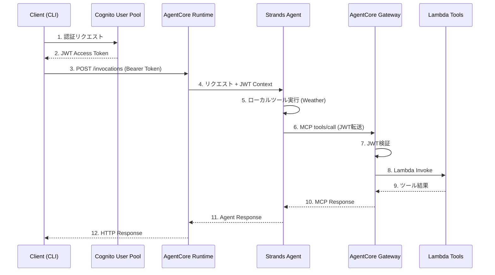

# JWT 認証システム

## 🔐 JWT 認証フロー

```mermaid
sequenceDiagram
    participant C as Client (CLI)
    participant Cognito as Cognito User Pool
    participant R as AgentCore Runtime
    participant A as Strands Agent
    participant G as AgentCore Gateway
    participant L as Lambda Tools

    C->>Cognito: 1. 認証リクエスト
    Cognito-->>C: 2. JWT Access Token

    C->>R: 3. POST /invocations (Bearer Token)
    R->>A: 4. リクエスト + JWT Context

    A->>A: 5. ローカルツール実行 (Weather)

    A->>G: 6. MCP tools/call (JWT転送)
    G->>G: 7. JWT検証
    G->>L: 8. Lambda Invoke
    L-->>G: 9. ツール結果
    G-->>A: 10. MCP Response

    A-->>R: 11. Agent Response
    R-->>C: 12. HTTP Response
```

