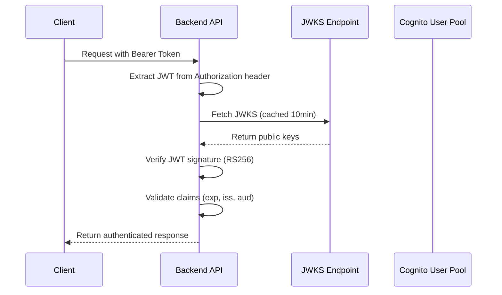

# Backend API Server

Express API server with JWT authentication support. Supports Amazon Cognito User Pool JWKS verification and is compatible with API Gateway + Lambda deployment.

## 📋 Table of Contents

- [Features](#-features)
- [API Endpoints](#-api-endpoints)
- [Setup](#-setup)
- [Development Environment](#-development-environment)
- [Docker Usage](#-docker-usage)
- [Environment Variables](#-environment-variables)
- [JWT Authentication](#-jwt-authentication)
- [Deployment](#-deployment)

## 🚀 Features

- **JWT Authentication**: Amazon Cognito User Pool JWKS verification
- **Express API**: RESTful API server
- **CORS Support**: Frontend integration
- **TypeScript**: Type-safe implementation
- **Docker Support**: Containerized execution environment
- **Health Check**: API Gateway / Lambda compatible
- **Development Mode**: JWKS verification skip feature

## 🔌 API Endpoints

### Health Check (No Authentication Required)

```bash
GET /ping
```

**Response Example:**
```json
{
  "status": "healthy",
  "timestamp": "2025-12-19T10:42:00.000Z",
  "uptime": 123.456,
  "service": "agentcore-backend",
  "version": "0.1.0",
  "environment": "development",
  "jwks": {
    "configured": true,
    "uri": "[CONFIGURED]"
  }
}
```

### Get User Information (Authentication Required)

```bash
GET /me
Authorization: Bearer <jwt_token>
```

**Response Example:**
```json
{
  "authenticated": true,
  "user": {
    "id": "12345678-1234-1234-1234-123456789012",
    "username": "john.doe",
    "email": "john.doe@example.com",
    "groups": ["users", "admins"]
  },
  "jwt": {
    "tokenUse": "access",
    "issuer": "https://cognito-idp.ap-northeast-1.amazonaws.com/ap-northeast-1_xxxxxxxxx",
    "audience": "your-client-id",
    "issuedAt": "2025-12-19T10:00:00.000Z",
    "expiresAt": "2025-12-19T11:00:00.000Z",
    "clientId": "your-client-id",
    "authTime": "2025-12-19T10:00:00.000Z"
  },
  "request": {
    "id": "req_1703057520123_abc123",
    "timestamp": "2025-12-19T10:42:00.000Z",
    "ip": "127.0.0.1",
    "userAgent": "Mozilla/5.0 ..."
  }
}
```

### API Information (No Authentication Required)

```bash
GET /
```

Returns API specifications and documentation information.

## 🛠 Setup

### Install Dependencies

```bash
# From project root
npm install

# Or directly in backend directory
cd packages/backend
npm install
```

### Configure Environment Variables

```bash
# Copy .env.example to create .env
cp .env.example .env

# Edit .env file to set required environment variables
```

## 👨‍💻 Development Environment

### Start Development Server

```bash
# From root (recommended)
npm run backend:dev

# Or directly from backend directory
cd packages/backend
npm run dev
```

### Build

```bash
# TypeScript compilation
npm run build

# Start production server
npm start
```

### Available Scripts

```bash
npm run dev          # Development server (hot reload)
npm run build        # TypeScript build
npm run start        # Start production server
npm run clean        # Delete build artifacts
```

## 🐳 Docker Usage

### Build Docker Image

```bash
# Build standalone
docker build -t agentcore-backend .

# Build & start with Docker Compose
docker-compose up --build

# Start in background
docker-compose up -d --build
```

### Docker Management Commands

```bash
# View logs
docker-compose logs -f

# Stop containers
docker-compose down

# Health check
docker-compose exec agentcore-backend curl http://localhost:3000/ping
```

### Available Docker Scripts

```bash
npm run docker:build       # Build image
npm run docker:run         # Simple startup
npm run docker:dev         # Start development environment with compose
npm run docker:dev:detach  # Background startup
npm run docker:stop        # Stop compose
npm run docker:logs        # View logs
npm run docker:test        # Health check
```

## ⚙️ Environment Variables

| Variable | Required | Default | Description |
|----------|----------|---------|-------------|
| `PORT` | ❌ | `3000` | Server port |
| `NODE_ENV` | ❌ | `development` | Execution environment |
| `CORS_ALLOWED_ORIGINS` | ❌ | `*` | CORS allowed origins |
| `COGNITO_USER_POOL_ID` | ⚠️ | - | Cognito User Pool ID |
| `COGNITO_REGION` | ⚠️ | - | AWS Region |
| `JWKS_URI` | ⚠️ | - | JWKS endpoint URL |
| `JWT_ISSUER` | ❌ | - | JWT Issuer (optional) |
| `JWT_AUDIENCE` | ❌ | - | JWT Audience (optional) |

⚠️ = Required in production environment

### Environment Configuration Patterns

#### Pattern 1: Development Environment (No JWT Verification)

```env
PORT=3000
NODE_ENV=development
CORS_ALLOWED_ORIGINS=*
# JWT settings not configured → Decode only
```

#### Pattern 2: Production Equivalent (With JWT Verification)

```env
PORT=3000
NODE_ENV=production
CORS_ALLOWED_ORIGINS=https://your-domain.com
COGNITO_USER_POOL_ID=ap-northeast-1_xxxxxxxxx
COGNITO_REGION=ap-northeast-1
```

## 🔐 JWT Authentication

### Supported Token Formats

- **Authorization Header**: `Bearer <jwt_token>`
- **Token Types**: Cognito Access Token / ID Token
- **Signature Algorithm**: RS256

### Verification Flow



### Development Environment Behavior

- **With JWKS Configuration**: Executes full JWT verification
- **Without JWKS Configuration**: Decode only (skip verification)
- **Production Environment**: Always execute JWKS verification

### JWT Payload Example

```json
{
  "sub": "12345678-1234-1234-1234-123456789012",
  "cognito:username": "john.doe",
  "email": "john.doe@example.com",
  "token_use": "access",
  "client_id": "your-client-id",
  "cognito:groups": ["users", "admins"],
  "iss": "https://cognito-idp.ap-northeast-1.amazonaws.com/ap-northeast-1_xxxxxxxxx",
  "exp": 1703061600,
  "iat": 1703058000,
  "auth_time": 1703058000
}
```

## 🚀 Deployment

### API Gateway + Lambda

This Backend API is designed for future deployment with AWS API Gateway + Lambda.

- **Health Check**: `/ping` endpoint
- **CORS**: Preflight support
- **Error Handling**: Standard HTTP status codes
- **JWT Verification**: Cognito User Pool integration

### Production Environment Checklist

- [ ] Set `NODE_ENV=production`
- [ ] Complete Cognito User Pool configuration
- [ ] Complete JWKS URI configuration
- [ ] Appropriate CORS origin settings
- [ ] Configure log monitoring
- [ ] Verify health check

## 🧪 Testing

### Local Testing

```bash
# Start server
npm run dev

# Health check
curl http://localhost:3000/ping

# JWT authentication test (requires token)
curl -H "Authorization: Bearer <your_jwt_token>" http://localhost:3000/me
```

### Docker Environment Testing

```bash
# Start with Docker
docker-compose up -d

# Health check
npm run docker:test
```

## 📝 Logging

Detailed logs are output for each endpoint access:

```
👤 /me request successful (req_1703057520123_abc123): { userId: '...', ... }
```

## 🤝 Contributing

1. Create feature branch
2. Implement changes
3. Run tests
4. Create pull request

## 📄 License

MIT License
